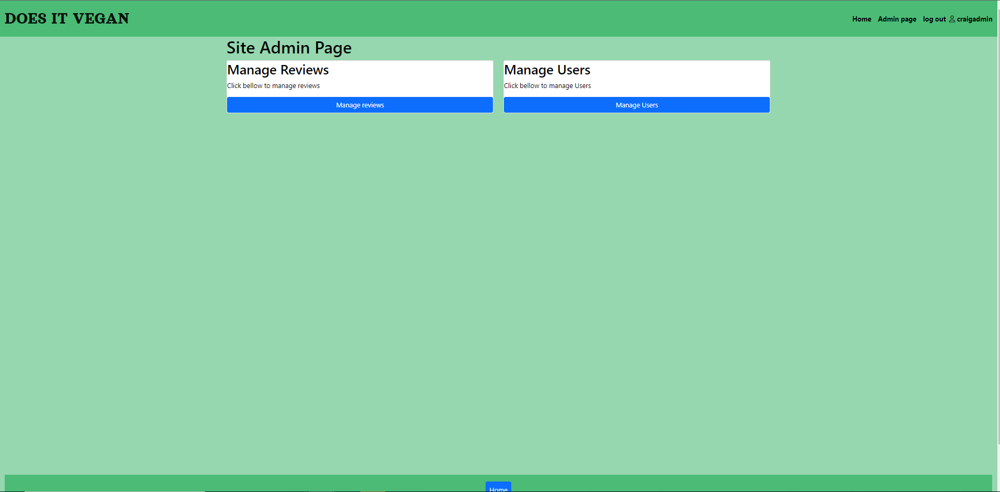
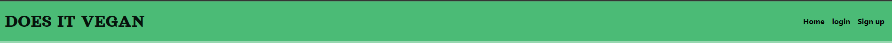

# Does it Vegan
Click [here](https://does-it-vegan.herokuapp.com/) to view the live web site 

### responsive design 

## UX

## Strategy
 

## Goals
* Create a web site that help people find restaurants that have vegan dishes in their area
* Have a web site that has a simple search function for users
* Users can post reviews of restaurant   
* users can add restraunts and dishes
* users can edit and delete dishes and reviews
* admin can delete users and aprove reviews

##### To achieve these goals I will need to:
* use python and django to creat a full stack web site
* Use CSS and HTML for the content and to make it look good
* create a functional data base
* deploy the site to heroku. 

#### agile
* used kanban board in github projects to work in an agile manner.  <a href='https://github.com/CraigThomasson/Does_It_-Vegan/projects/1'>view</a>

#### user stories 
* user stories can be viewd on kanban board [here](https://github.com/CraigThomasson/Does_It_-Vegan/projects/1).

## Wireframe for Original Concept

## data base schema

 

## Functionality
## home page

* On the load screen the user will see the title and hero image and see clearly the intentions the page. There are instructed to search for a town or city. The  colour scheme is a nice vegan green. 
* The user will see the instructions for how to begin search for a location or can add there own restaurant.
### Testing
* all links and butons where tested on this page
* page displayed correctly to authenticated users and gest users.

## search results

* If the user search is successful they will see the results on this page
* A user can read a brief description of each restaurant returned 
* A user can click on the view button to view a restaurant
### Testing
* all links and butons where tested on this page
* page displayed correctly to authenticated users and guest users.
 

## restaurant details

* page displays restaurant details
* gest user can see dishes and reviews
* logged in users can add dishes and reviews and edit there own.
* buttons will be render for logged in users, as can be seen [here](documentation/images/pages/restraunt-details-user.PNG)
### Testing
* all links and butons where tested on this page
* page displayed correctly to authenticated users and guest users.
* edit and delete buttons displayed only to users who created the reviews/dishes

## add restaurant

* This page generates a form logged in users can user to add a restaurant.
* when a restaurant is add they geta message saying they where successfull
### Testing
* all links and butons where tested on this page
* page displayed correctly to authenticated users and guest users.
* data was stored to db correctly
* success message diplayed correctly.

## add dish

* the user can use the from on this page to add a dish to a restaurant.
* a message is displayed when they are successfull
### Testing
* all links and butons where tested on this page
* page displayed correctly to authenticated users and guest users.
* data was stored to db correctly
* success message diplayed correctly.

## edit dish

* the user can use the from on this page to edit a dish.
* a message is displayed when they are successfull
### Testing
* all links and butons where tested on this page
* page displayed correctly to authenticated users and guest users.
* forms where prfilled with correct data from DB
* data was stored to db correctly
* success message diplayed correctly.

## add review

* the user can use the from on this page to add a review.
* a message is displayed when they are successfull and an admin will review their post
### Testing
* all links and butons where tested on this page
* page displayed correctly to authenticated users and guest users.
* data was stored to db correctly
* success message diplayed correctly.

## edit review

* the user can use the from on this page to eddit a review.
* the form is prepopulated with the current review data
* a message is displayed when they are successfull
### Testing
* all links and butons where tested on this page
* page displayed correctly to authenticated users and guest users.
* data was stored to db correctly
* success message diplayed correctly.

## site admin

* users in the site admin group can access this page
* from this page they can navigate to the manage user page and the manage reviews page
### Testing
* all links and butons where tested on this page
* page displayed correctly to authenticated users and guest users.

## manage user

* site admin can see a list of user on this page and delete users.
### Testing
* all links and butons where tested on this page
* page displayed correctly to authenticated users and guest users.
* data was stored to db correctly

## manage review

* site admin can see a list of reviews awaiting aproval on this page.
* site admin can aprove reviews on this page.
### Testing
* all links and butons where tested on this page
* page displayed correctly to authenticated users and guest users.
* reviews diplayed when aproved

## nav bar

 

 

* site admin can see a link for the admin page when logged in.
* logged in users can see they are logged in on unsder what username.
* guest user can only see basic options on the nave bar. 
* the log out button is renderd when a user logges in. 
### Testing
* all links and butons where tested
* displayed correctly to authenticated users and guest users.

## search bar

 

 

* guest users and see the search bar on the home page and a link to logg in if they want to add users
* logged in user see the add restaurant link under the saaerch bar

## Deployment

### Forking the GitHub Repository

* Access your GitHub account and find the relevant repository.
* Click on 'Fork' on the top right of the page.
* You will find a copy of the repository in your own Github account.
* Making a Local Clone
* Access your GitHub account and find the correct repository.
* Click the 'Code' button next to 'Add file'.

### Heroku

* Create an account at heroku.com
* Create a new app, add app name and your region
* Click on create app
* Go to "Settings"
* Under Config Vars, add your sensitive data
* Go to "Deploy" and at "Deployment method", click on "Connect to Github"
* Enter your repository name and click on it when it shows below
* Choose the branch you want to buid your app from

### Clone to Run Locally
* In the repository on Github click the Code drop-down button next to the green Gitpod button
* Download ZIP file and unpackage locally and open with IDE. 

### Fork the Repo
* On GitHub navigate to the repository you want to fork
* In the top right corner of the page, click Fork

## Testing

* The site was tested in [google chrome](documentation/images/load-page.PNG), [Firefox](documentation/images/firefox.PNG), [Microsoft edge](documentation/images/edge.PNG)
* It was also tested on [android](documentation/images/android.jpg) and [IOS](documentation/images/ios-2.jpg) phones.
* As evidenced above I also tested on multiple view ports.

## Validation

* CSS was ran through (Jigsaw) validator and has no errors: results [here](documentation/images/css-val.PNG)
* HTML was ran through W3C validator with no issues: results <a href="http://validator.w3.org/check?uri=https://craigthomasson.github.io/project-2-wheel-of-time-quiz/">here</a>
* JS was ran through JSHint with [these](documentation/images/js-val.PNG) results. (There were also several missing semicolons that I added befre taking this screenshot.)

## Lighthouse Scores

* These are results from my second run. In my first run I had to add margins to difficulty buttons for mobile sizes and meta description in the head of the HTML.
* I also changed a h3 element to h2 to help with accessibility. 

## Technologies used
HTML, CSS, JavaScript and summernote
https://favicon.io/favicon-converter/
google fonts https://fonts.google.com

## images
usplash
restaraunt-image-1 https://unsplash.com/photos/GXXYkSwndP4 
chipy - https://unsplash.com/photos/YOW3de4wEDk
go vegan - https://unsplash.com/photos/FoVrVBxEefU
favicon - https://pixabay.com/vectors/avocado-slice-heal-fresh-green-5130214/

## credits 

### Sources and References
* Google fonts were used in this project: https://fonts.google.com/
* Font Awesome was used in the footer: www.fontawesome.com
  
## acknowledgements

* I would like to thank my mentor Chriss Quinn again for pushing me to produce my best work and being the best mentor that ever mentored.
* dave and dasiy mentor - for helping with deployment
* Daniel_C_5p - advise on testing
